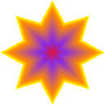
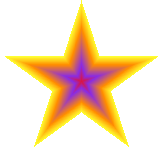
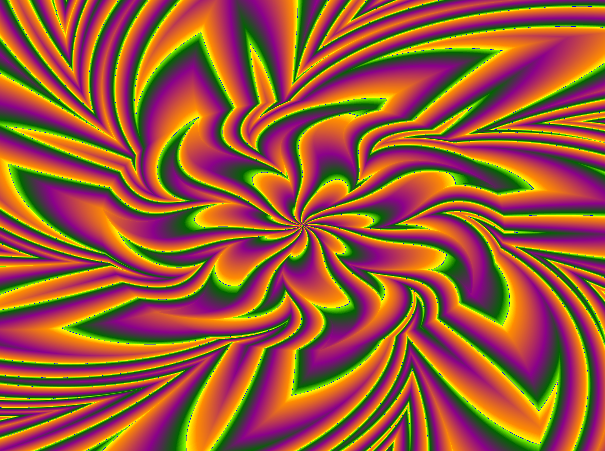
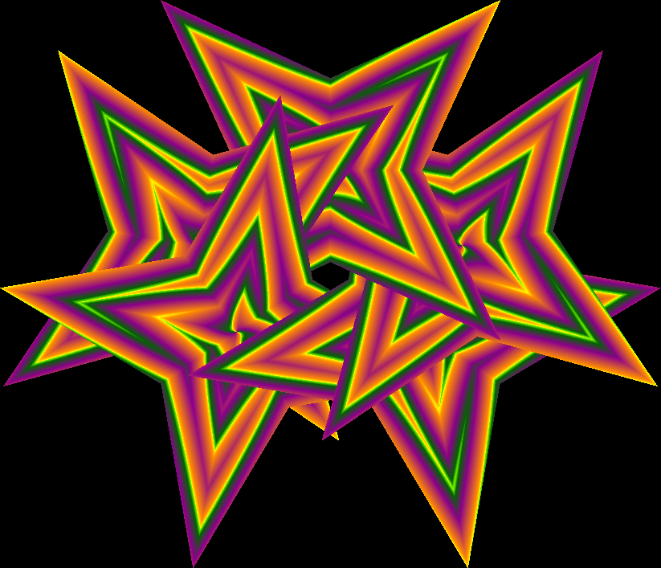
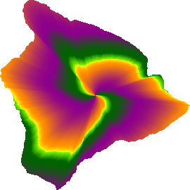

The Rainbow-Maker is a tool for producing "sculpted" gradients.  Typically, when you use graphics creation software, you can create a shape and fill it with a gradient, but the gradient itself is not in the shape of the shape; it is simply linear or radial and then your shape "cuts" it like a "cookie-cutter".  The Rainbow-Maker creates gradients that are themselves shaped (sculpted) like your shape.

The Rainbow-Maker was originally written in PHP 5.3 and required a server to produce the graphics.  It used an HTML "form" for a user-interface front-end, which sent the data to the server to be processed.  The PHP software itself was not well organized for one simple reason: it needed to be a single "PHP Class" to be hosed on <a href='https://www.phpclasses.org/package/7363-PHP-Create-transparent-gradient-images.html'>PHPClasses.org</a>.  That was before JavaScript supported graphics, and the MS Internet Exploder was king.  It was very unfriendly to use, but it worked.  You can download the original pakage from <a href='https://softmoon-webware.com/OpenSource.php>SoftMoon-WebWare</a> 

This repository will host the port of the original PHP Rainbow-Maker to JavaScript.

A simple example of what this package can produce:

Compare that with what most graphics development software can produce:

The Rainbow-Maker can work with all kinds of standard geometrical shapes, shapes you define geometrically, as well as "random" shapes in a bitmap filter.  It can also do so much more with your sculpted gradient.

More coming.....
